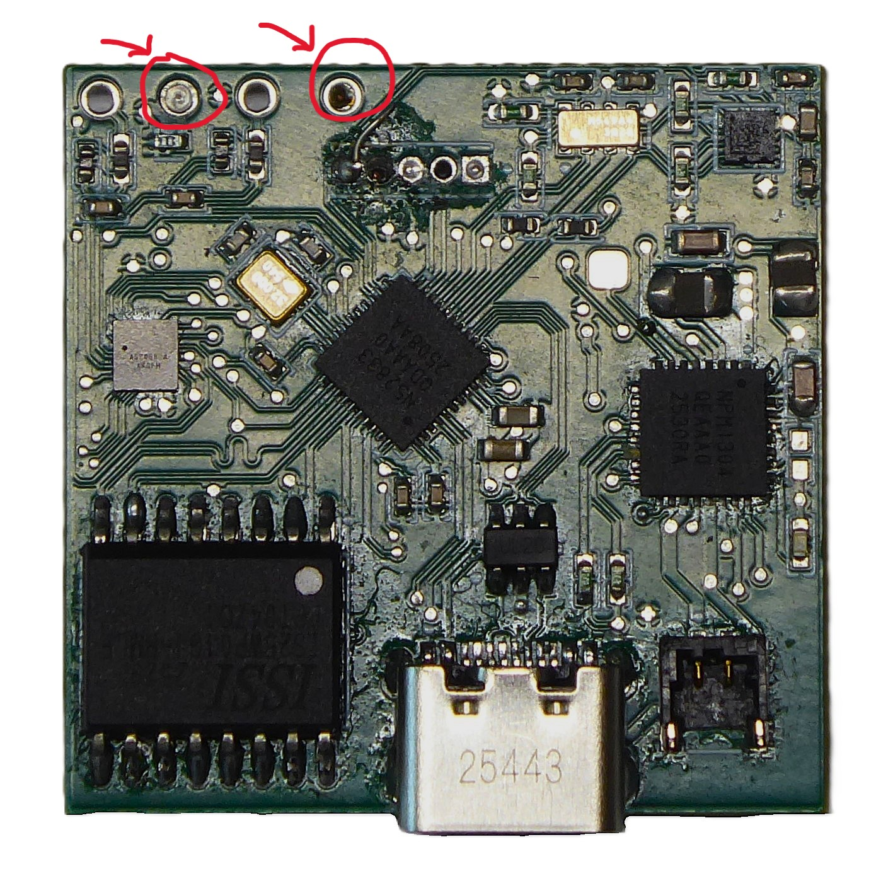

# Hardware Documentation

## Overview

Here is presented a documentation for hardware, mechanical and electronics parts. Here described hardware manufacturing, assembly process and testing.

## Table of Contents

1. [Specifications](#specifications)
2. [PCB](#pcb)
3. [Mechanical](#mechanical)
4. [Full assembly](#full-assembly)
5. [Testing & Validation](#testing--validation)
6. [Bill of Materials (BOM)](#bill-of-materials-bom)

## Specifications

| Parameter | Value | Notes |
|-----------|-------|-------|
| Dimensions | 46.3 x 34 x 16.9 mm| |
| Sensors |PPG, EDA, IMU| For hear rate, SpO2, stress measurements and step counting|
| Weight | 42 grams | Weight with the strap|
| Operating Voltage | 3.6-4.2V | From the battery |
| Current Consumption | 1mA | When PPG and EDA measurements are on |
| Wrist circumference | 150-240 mm | |
| Charging current | 100mA | |
| Battery capacity | 800mA | Smaller battery capacity can be used |

## PCB
### PCB ordering

In this section described ordering process of the PCB manufacturing from JLCPCB.

After uploading gerber zip archive form [`./PCB/Fabrication files/Gerber.zip`](https://github.com/kitnol/Open-Wrist-Band/blob/main/Hardware/PCB/Fabrication%20files/Gerber.zip) There is few key options needed to be selected for PCB to be manufactured correctly.

Necessary options:
- **Layers**: 4
- **PCB Thickness**: 1.6mm
- **Surface Finish**: LeadFree HASL
- **Outer Copper Weight**: 1oz
- **Inner Copper Weight** 0.5oz
- **Via Covering**: Epoxy Filled Capped 
- **Min via hole size/diameter**: 0.15mm/(0.25/0.3mm) 

Recommended options:
- **Product Type**: Medical
- **Electrical Test**: Flying Probe Fully Test

### PCB Assembly

You can choose between two methods for assembling the PCB:

- **Manual Assembly**: Order all components listed in the `BOM.csv` and assemble the board entirely on your own.

- **Partial Assembly by JLCPCB**: Upload both `BOM.csv` and `CPL.csv` to the JLCPCB website for automated assembly.

**Important Note**: Because they are not carried in the standard JLCPCB component library, you must purchase the following parts separately and solder them yourself:

- Flash Memory: IS25WP01GJ

- Power Management IC (PMIC): nPM1304

Depending on the time of order additional components may occasionally be out of stock at JLCPCB, requiring you to source and solder them manually as well.

## Mechanical 

### Enclosure manufacturing

The primary method for fabricating the enclosure is FDM 3D printing.

- **Material Selection**: PETG is the recommended choice, though PLA or any other hypoallergenic (skin-safe) plastic may be used.

- **Post-Processing**: After printing, sand the parts and apply a layer of filler-primer to smooth out the print lines.

**Important Safety Note**: Because this device comes into contact with the body, ensure that all selected plastics, primers, and finishes are non-allergenic and completely skin-safe once fully cured.

### Electrodes

The electrodes can be fabricated using either CNC machining or metal 3D printing, utilizing the 3D model found in `./3d models/Electrode.stl`.

- **Material**: Stainless Steel 316 (SS316) is required.

- **Surface Finish**: Because these electrodes come into direct contact with the skin, they must be polished to a smooth surface finish to prevent irritation.

After fabrication, spot-weld a nickel strip to each electrode (the enclosure features a dedicated cutout to accommodate this). These nickel strips provide a solderable surface, allowing you to connect a wire from the electrodes directly to the PCB.

### PPG window

For the PPG sensor to function correctly, it requires an unobstructed view of the skin while remaining protected from sweat and moisture. To achieve this, fabricate a small protective separator from a **0.5 mm thick sheet of transparent PET plastic or glass**. Installation Steps:
  
- **Cut the Window**: Cut a $11.4 \text{ mm} \times 12.4 \text{ mm}$ rectangle out of the transparent material.
  
- **Apply Adhesive**: Using a toothpick, carefully apply a small amount of superglue along the recessed rim of the enclosure's cutout. 
  **Caution**: Avoid getting any glue near the center of the cutout where it could obscure the LEDs or photodiodes.
  
- **Set the Window**: Place the transparent window into the cutout and apply light, steady finger pressure for 1 to 2 minutes to ensure a secure bond.

## Full assembly

Once all components have been sourced and manufactured, you can proceed with the final assembly.

**Important**: You must flash the firmware onto the MCU using a J-LINK debugger before assembling the hardware. Please refer to the flashing guide located in the [Software](https://github.com/kitnol/Open-Wrist-Band/tree/main/Software) folder before proceeding. Also remove the male pins for J-LINK after programming, future updates can be done via USB.

**Step 1: Install the Electrodes**

1. Gather the fully prepared electrodes (with nickel strips attached), the casing body, and the 3D-printed jig (Glue_support.stl).
   
2. Route the nickel strip through its designated cutout in the casing, apply superglue beneath the electrode, and press it firmly into position.
   
3. Use the Glue_support.stl jig to clamp the casing body and electrode securely in a vice.
   
4. Allow **10–20 minutes** for the glue to fully cure. Repeat this process separately for each electrode.

**Step 2: PCB Mounting & Wiring**

1. Seat the PCB into the casing body.
   
2. Solder lead wires onto the exposed electrode nickel strips.
   
3. Solder the opposite ends of these wires into holes 2 and 4 of the PCB (located on the side opposite the USB port, counting sequentially from the outer edge of the PCB).

**Step 3: Battery Installation & Final Closure**

1. Connect the battery, position it neatly on top of the PCB, and place the lid over the casing.

2. Caution: Double-check that no wires are pinched or trapped between the casing body and the lid.
   
3. Secure the enclosure using four M2 x 3mm screws to complete the assembly.

## Testing & Validation

### Hardware Testing
- [ ] Short circuits test
- [ ] Power test
- [ ] Charging test **(TODO)**

#### Short circuits test

Pre-Power Short Circuit Test

Once the PCB is fully assembled, you must test it for short circuits before applying power. Set your multimeter to continuity mode and check the continuity between the following points:

- **GND** and the **1.8V** line

- **GND** and the **2.4V** line

- **1.8V** line and the **2.4V** line

If the multimeter does not beep (indicating no continuity), it is safe to power on the PCB. If continuity is detected, a short circuit exists. <u>Do not apply power until you locate and resolve the source of the short.</u>

#### Power testing

Before programming, power the PCB via USB or battery and use a multimeter to measure the 1.8V and 2.4V lines. If the voltages are correct, it is safe to proceed with programming.

**Troubleshooting Guide:**

- **Voltages are too low**: Check the power input to ensure the board is receiving either 5V (USB) or 3.7V–4.2V (battery).

- **1.8V line is too high**: Immediately disconnect power. Verify that resistor R6 is 47 kΩ. Note that if this line exceeded 1.98V, the AS7058 component is likely damaged and must be replaced.

- **2.4V line is too high**: Power off the PCB immediately and verify that resistor R7 is 47 kΩ. Component damage is unlikely on this line, so no replacements should be necessary once the resistor issue is fixed.

## Bill of Materials (BOM)

### Mechanical BOM

| Part number | Description  | Quantity | Unit Price | Source |
|-----------|--------------|-------|------|--------|
| AM4885 | Li-Pol battery 800mAh, 3.7V, 622540 | 1 |€6.55 | [AM4885](https://ampul.eu/en/battery/6303-li-pol-battery-800mah-37v-622540) |
| ACHLR-02V-S | Battery connector | 1 | €0.13 | [ACHLR-02V-S](https://www.digikey.de/en/products/detail/jst-sales-america-inc/achlr-02v-s/5272191) |
| ASACHLSACHL28W152 | Battery wires | 1 | €0.98 | [ASACHLSACHL28W152](https://www.digikey.de/en/products/detail/jst-sales-america-inc/ASACHLSACHL28W152/8107430?s=N4IgTCBcDaICwFYEFoDMYEHZkDkAiIAugL5A) |
| M2 3mm | Screw for lid | 4 | €5.88 | [M2 3mm](https://dk.rs-online.com/web/p/maskinskruer/9141560) |
| PET 0.5mm | Plastic sheet | 1 | €7.5 | [PET 0.5mm](https://www.amazon.com/Plastic-Clarity-Resistant-Display-Packaging/dp/B0GJ6CKP9T?th=1) |

**Total Cost**: €38.68

### Electronics BOM
| Designator | Description | Footprint | JLCPCB Part | Quantity | Unit price ($) | Total cost ($) |
|-------------|-------------|-----|-----------|---------|---------|---------|
| C1, C3, C4, C5, C6, C8, C10, C16, C21, C22, C32, C33, C34, C35 | 100nF | 0402 | C1525 | 14 | $0.0017 | $0.0238 |
| C2 | 10 µF | 0402 | C15525 | 1 | $0.0178 | $0.0178 |
| C7 | 1 µF | 0402 | C52923 | 1 | $0.0053 | $0.0053 |
| C9, C11, C14, C17, C25 | 1µF 40% 50V | 0603 | C15849 | 3 | $0.0156 | $0.0468 |
| C15, C19, C23, C24, C26 | 10 µF | 0603 | C19702 | 5 | $0.0149 | $0.0745 |
|  | 1 µF | 0603 | C15849 | 2 | $0.0108 | $0.0216 |
| C18 | 2.2 µF | 0603 | C49326366 | 1 | $0.0092 | $0.0184 |
| C20 | 100 pF | 0402 | C1546 | 1 | $0.0014 | $0.0014 |
| C27 | 4.7 µF | 0603 | C19666 | 1 | $0.0138 | $0.0138 |
| C28, C29, C30, C31 | 0.047 µF | 0402 | C82219 | 4 | $0.0024 | $0.0096 |
| C36, C37 | 12 pF | 0402 | C1547 | 2 | $0.0016 | $0.0032 |
| D1, D2 | SFH 7018A | SFH 7018 | C24570310 | 2 | $1.8124 | $3.6248 |
| D3, D4 | Blue LED | 0402 | C22355736 | 1 | $0.0087 | $0.0174 |
| D5, D6, D7, D8 | TVS DIODE | 0402 | C10676 | 4 | $0.0426 | $0.1704 |
| D9, D10, D11, D12 | SFH2705 | DFN175P2 | C6672359 | 4 | $1.7060 | $6.824 |
| J1 | USB-C Molex-2171790001 | SMD | C3197684 | 1 | $0.6895 | $0.6895 |
| J2 | Battery connector BM02B-ACHLKS | FP-BM02B | C594367 | 1 | $0.7975 |$0.7975 |
| J3 | M50-3530542 | Plugin,P=1.27mm| C6293302 | 1 | $0.3278 | $0.3278 |
| L1, L2 | CIGT201610LH2R2MNE | 0806 | C307626 | 2 | $0.1070 | $0.214 |
| R1, R2, R12, R13 | 5.1K | 0402 | C25905 | 4 | $0.0009 | $0.0036 |
| R3, R4, R5, R8, R11, R14, R19, R20, R21, R22, R23, R24, R25 | 10K | 0402 | C844452 | 17 | $0.0013 | $0.0221 |
| R6, R7 | 47K | 0402 | C25792 | 2 | $0.001 | $0.002 |
| R9, R10, R16, R17 | 100K | 0402 | C25741 | 4 | $0.0009 | $0.0036 | 
| R15, R26, R27, R28 | 4.7K | 0402 | C25900 | 4 | $0.001 | $0.004  |
| R18 | 1K | 0402 | C11702 | 1 | $0.001 | $0.001 |
| U1 | LIS2DS12TR | LGA-12(2x2) | C915682 | 1 | $2.0411 | $2.0411 |
| U2 | nRF52833 | QFN40_5X5 | C3007767 | 1 | $5.0552 | $5.0552 |
| U3 | NPM1304 | QFN32 | C49449665 | 1 | $4.3002 | $4.3002 | 
| U4 | RV-3028-C7 | FP-RV-3028-C7 | C3019759 | 1 | $2.2667 | $2.2667 |
| U5 | AS7058 | WLCSP-42(2.8x2.6) | C23782775 | 1 | $7.5763 | $7.5763 |
| U6 | IS25WP01GJ-RMLE-TY (128MB) | 16-SOIC | [DigiKey](https://www.digikey.de/en/products/detail/issi-integrated-silicon-solution-inc/IS25WP01GJ-RMLE-TY/29286651?s=N4IgTCBcDaIJIGUwFYDqAFADARgOICkBaAJQFkAZAUUIBUBNEAXQF8g) | 1 | $14.38360 | $14.38360 |
| U7 | USBLC6-2SC6 (ESD) | SOT-23-6 | C2827654 | 1 | $0.0410 | $0.0410 |
| Y1 | XYDCELNANF-32M | SMD2520-4P | C124330 | 1 | $0.3137 | $0.3137 |

**Total Cost**: $48.8926

---

**Last Updated**: 06-06-2026