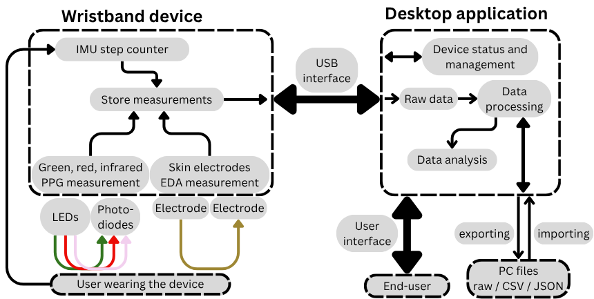

# Open-Wrist-Band
Open-wrist-Band it is an open source project which created a wrist band that can measure various physiological parameters. The project features hardware and software deign. Main features:
- Photoplethysmography sensor (PPG)
- Electro Dermal Activity sensor (EDA)
- Internal Measurement Unit sensor (IMU)
- Examples of signal processing  algorithims

## File structure
Project is devided into two folders hardware and software consecutively.  
The hardware folder contains all of the 3D models and PCB design files.  
The software folder contains the scripts for the desktop sofware and ZephyrOS nRF SDK code for the wristband device running on nRF 52833.  
More features and how to get the device set up are described in detail in the individual README.md files within each folder.
## System overview
The system consists of a wearable wristband and a companion desktop application, interconnected via a USB interface
  
The wristband measures and saves PPG, EDA and steps data in the onboard memory throughout the week, which is then offloaded to the desktop using a USB-C cable. The measurement parameters (frequency, LED brightness...) can be configured within the AS7058 chip driver. The captured data is then parsed and can be analysed using python notebooks.