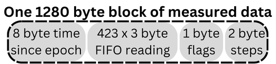
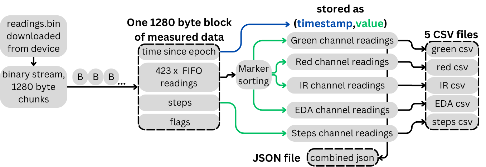

# Desktop software
### Files:
- `Analysing_Green_LED_data.ipynb` - Python notebook with example code for analysing gathered green led measurements for BPM calculation
- `Analysing_Red_IR_LED_data.ipynb` - Python notebook with example code for analysing gathered red and infrared led measurements for blood oxygen calculation
- `data_recieve.py` - Example code for receiving byte chunks and saving them in raw binary file. The script needs to have correct number of receiving byte chunks set and correct COM port set. Example of one FIFO reading (one byte chunk)   
  
- `data_parse.py` - Example code for parsing byte chunks and the markers and ADC values within it. *TODO: sorting measurements by markers and exporting to different files*  
  
- `m_green.csv` - Example data captured by photodiodes of green LED shining
- `m_red_IR.csv` - Example data captured by photodiodes of red and IR LED shining, alternating every other measurement starting with IR being first line
