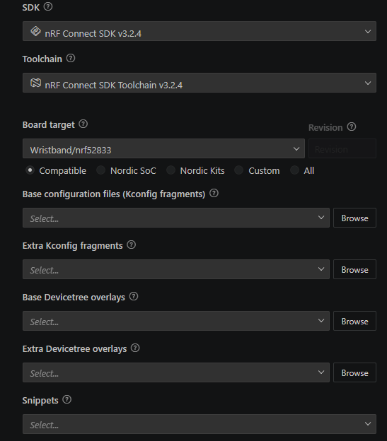
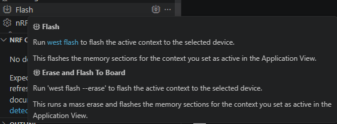

# wwdevice
Wristband device
Documentation
### Project files structure:
- boards/ - custom board import into Zephyr OS based on the PCB design and required features outlined, contains pin mapping definitions and enables individual subsystems (I2C, SPI, USB, UART)
- src/ - all of the source code that is part of the app
  - main.c - main code setup
  - as7058_drv.c - custom made driver for AS7058 bio chip based on its datasheet
  - flash_drv.c - flash layer for the onboard spi nor flash - littlefs implementation
  - shell.c - the implementation of shell commnads
  - usb_drv.c - the implementation of the usb interface management
- sysbuild/ - mcuboot bootloader implementation and configuration
- app.overlay - configuration of specifc components present on the board
- prj.conf - kconfig project configuration enabling and configuring different zephyros features

Step-by-step guide on how to set up coding environment for embedded software development. The firmware was developed using nRF connect SDK v3.2.4 with nRF extensions enabled, using Visual studio code.

## Environment setup
1. Download Nordic semiconductor SDK for nrf52833 in Visual studio code
2. Open/import the project folder from github
3. Go into your SDK installation ncs\v3.2.4\bootloader\mcuboot\zephyr\main.c and implement https://github.com/mcu-tools/mcuboot/pull/1903 
This feature was added to allow entering DFU mode (for code flashing) after triggering a hardware reset, instead of entering DFU mode on every single after power-up. This improves power usage by not wasting time in DFU mode when not needed, while keeping the feature to allow for reflashing with non-functional software without a J-link debugger.

## Flashing of an empty board
1. (if needed) Create the build configuration, ensure sysbuild is enabled and the board target is correctly selected
2. Build the project using nRF Connect SDK actions (or by *west build*)
3. **IMPORTANT** - Ensure the Segger J-link device is set to **1.8V voltage level** as higher voltages can fry some of the PCB components
4. Connect the Segger J-link to the board using the pin interface, ensure that the "detect pin" on the Segger J-link device is pulled to ground, if needed, as the PCB itself supports only 5 pin J-link interface and does not interact with the "detect pin".
5. Flash the entire build (sysbuild) onto the nRF microcontroller using built in nRF Connect SDK actions (or by *west flash*)

## Flashing of a board with MCUboot present on it
Prerequisite: Download and open AuTerm as mentioned in course https://academy.nordicsemi.com/courses/nrf-connect-sdk-intermediate/ within Lesson 9 - Bootloaders and DFU 
1. Build the project using nRF Connect SDK actions (or by *west build*)
2. Locate the file in ``build/<folder_name>/zephyr/zephyr.signed.bin`` and open it in AuTerm's MCUmgr
3. Connect the board using USB
4. Press the reset button on the board (if present) or short the reset pin of J-link interface to the ground on the board. (TODO: implement command in shell interface to trigger DFU mode)
5. Find the device in AuTerm and open communication with it
6. Flash using the MCUmgr section  
