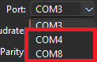
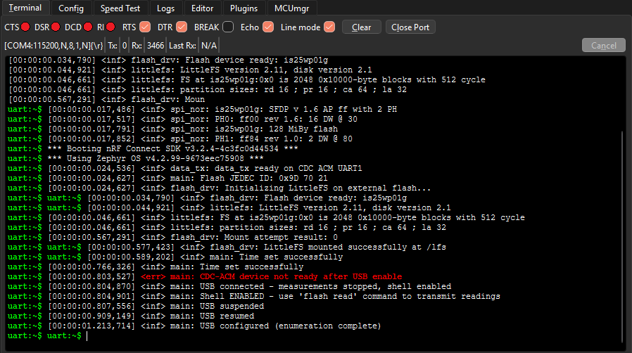
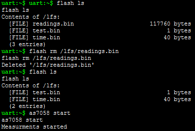
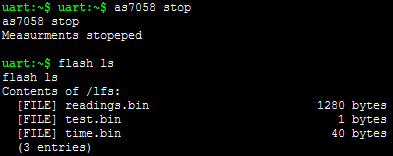
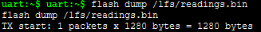
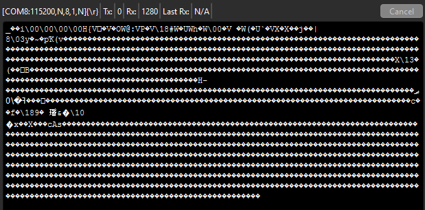
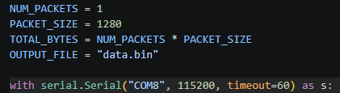
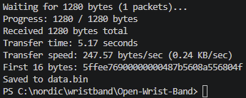
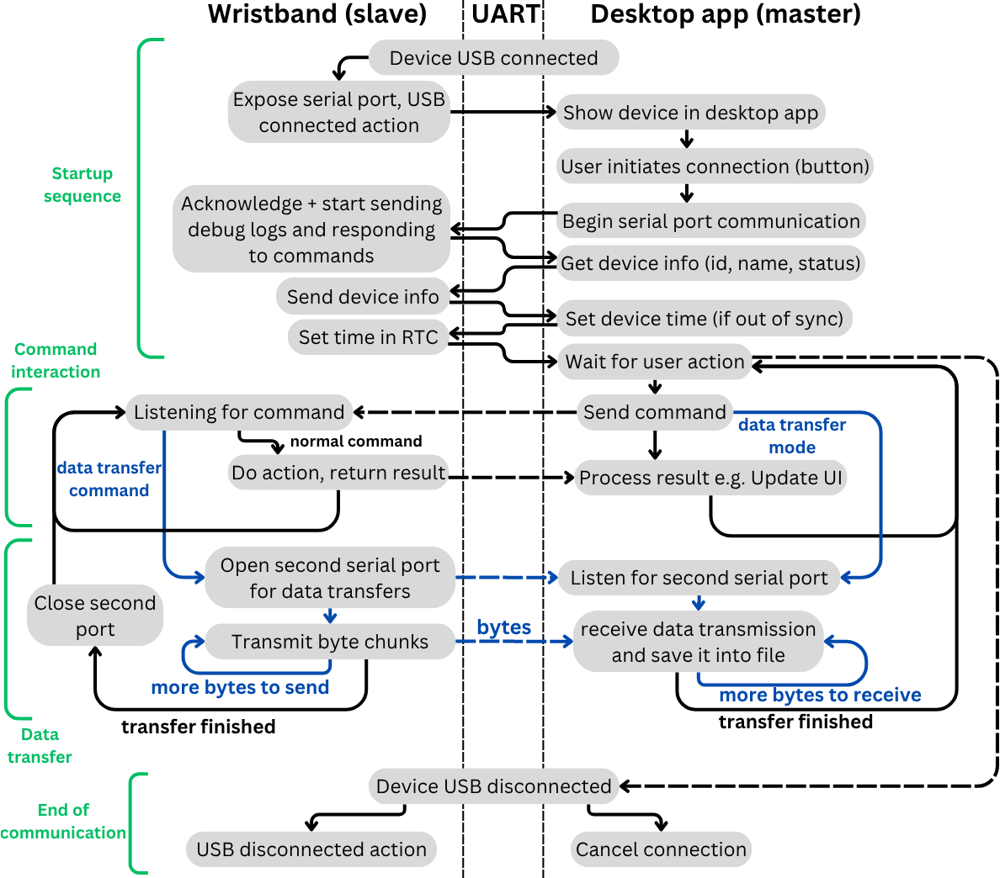

## Folder structure
The code is split into two subfolders, embedded software and desktop software. The desktop software is written using python whereas the embedded software is written with C using ZephyrOS RTOS implementation.
## Device communication
The communication betweend the PC and the embedded device happens with UART over USB (USB CDC ACM) using ZephyrOS shell implementation. Custom commands are predefined in the embedded code to allow the desktop app to interface and configure the device. The connection happens in master-slave configuration where the PC (master) sends the commands and the device (slave) responds to the commands.
> **Table:** Defined commands for the interface, commands marked with (dbg) are meant for debugging only.

| Cmd | Subcommand | Behavior of MCU | Behavior of application |
| --- | --- | --- | --- |
| `rtc` | `get` | Send current RTC time to the application | Check if device time is correct, sync if it is not and warn user |
| `rtc` | `set y.m.d h:m:s` | Set received time from application to RTC | Send system time to MCU, tell user if time was set correctly |
| `as7058` | `start` | Start measuring data | Show device as measuring |
| `as7058` | `stop` | Stop measuring data | Show device as not measuring |
| `as7058` | `read` | Transmit current FIFO buffer to the app | (dbg) Show incoming FIFO bytes |
| `flash` | `ls` | List files | (dbg) Show files in the folder |
| `flash` | `info <path>` | Send file info at path | Asks for readings.bin, shows how much measured data there is |
| `flash` | `dump <path>` | Transmit raw binary data (bytes) of the file | Receive transmitted binary data and save them |
| `flash` | `hex <path>` | Send hex dump of the file | (dbg) Used to inspect files |
| `flash` | `rm <path>` | Delete the file at path | Triggered by clearing current measurements from device, tells user if completed |
| `config` | `getid` | Send configured ID | Show ID of the device |
| `config` | `setid <id>` | Set device ID to the received ID | User sets the ID, shows updated ID |
| `config` | `get` | Send current config on device | Show device config in UI |
| `config` | `set <bytes>` | Receive config and save it to memory | Set device config based on how the user cofigured it in UI config |
| `<any>`  | `<any>` | (dbg) Do action of the built-in command| (dbg) Send any of the built-in zephyros shell commands

### Connection
Upon connection the device opens two COM ports to the PC, one meant for the shell interface and the other one meant for the binary data flash dumps. Because the desktop application itself is currently not developed, separate standalone scripts are used for recieving the data dumps, while the shell interface is used manually by the user using a serial terminal e.g. AuTerm to configure the device and initiate the transfers.

## Setting up device to take measurements (Manually using shell)
To setup measurements after the device is successfully flashed we need to tell it to start measuring. This functionality remains to be implemented in the user interface to simplify the process.
#### Connecting the device
1. Open a serial terminal application (AuTerm is used in this case, but we can use any other) 
2. Connect the device using USB-C cable and find the COM ports corresponding to the device, there should be two new COM ports showing up. The ports will have random numbers as they are assigned by the PC.  

3. Open one of the ports to the device, if nothing shows up it is the data transfer port. Close it and open the other port where the shell interface should show up.  

#### Starting measurement
4. We can see the onboard files using command `flash ls`. If we want to delete previous measurements so they do not mix up, we can use `flash rm /lfs/readings.bin`. Otherwise the measurements get appended at the end of the file
5. To start the measurement we send `as7058 start`. Depending on the measurement configuration we should start seeing LEDs blinking on the bottom of the device.  

6. In case we want to read the AS7058's FIFO memory while the measurements are running we can use `as7058 read` which will dump the current FIFO readings into the shell interface, instead of saving them into readings.bin. The device then continues taking measurements normally and would save the next FIFO memory measurements into the readings.bin file when the FIFO threshold is reached. It is important to note that this should be used for debugging only as it can create discontinuities in the readings.bin file.
## Stopping measurements and offloading the data (Manually using shell + scripts)
We begin with the same steps for connecting the device as previously.
### Stopping measurement
4. We stop the measurements by sending `as7058 stop`
5. We can see the size of collected measuremnts by doing `flash ls` where it shows the number of bytes  

### Offloading data
6. We initiate the offloading by sending shell command `flash dump /lfs/readings.bin` Then either by using a second serial terminal or by using the script data_receive.py we can capture the incomming transmission. The transmission is blocking so the data will wait for the port to be opened and won't be lost if we initiate the transmission without having the second port open first. From the command we can see the number of packets and number of bytes of the incoming transmission.  

#### Using second serial terminal
7. We initiate the connection on the second COM port shown by the device. We can see the incoming data captured in the terminal. If possible we can then export the data from the terminal.  

#### Using the data_receive.py script
7. We open the receiving script. Modify the number of packets based on the output of the flash dump command and change the COM port to the second COM port of the device. We can also modify the desired file name.  

8. We can see the transmission happening and the data being saved in the .bin file.  

## To be implemented:
This is how it was envisioned that the device-application connection would interact, with a flowchart describing the behavior upon USB connection. This remains to be implemented from the desktop application side.

